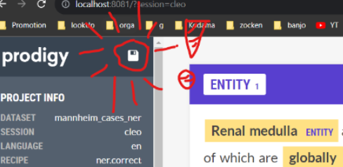
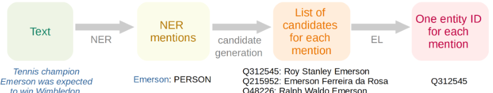
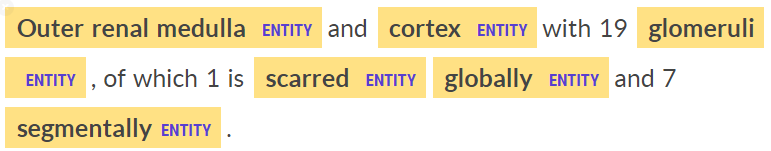
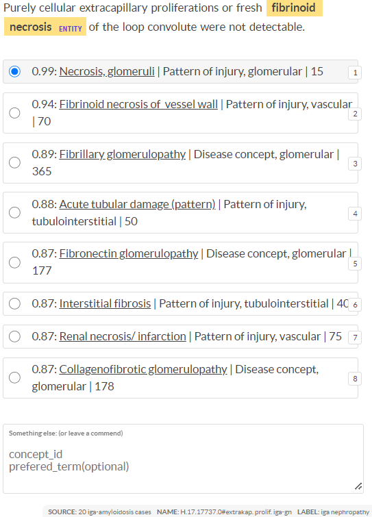

# User Guide for Concept Recognition Annotation

Most important:

## Save & Pause your annotation session:

Never forget to glick the save-icon before closing the annotation-we-page! 
Otherwise You have to do all the annotations again.

If you want to do a brake, hit the save icon and close the web-browser. 
If you open your annotation-web-page again, it will continue where you left.

## Two Annotation phases

Our KBC-concept recognition pipeline works like this:

So we have 2 annotation phases:

### Phase 1) NER-Annotation:

First, we have a NER (Named Entity Recognition) Phase, where we simply search _medical terms_ in the tests.
It is a binary NER model which simply marks sections in the texts, which might be a medical concept.

### Phase 2) NEL-Annotation:

Second, we have a NEL (Named Entity Linking) or EL (Entity Linking) Phase. 
In this phase, we select one concept from the given terminology (in this case: KBC) for each highlighted medical term/entity.

For each marked text excerpt, the KBC terminology is searched for KBC concepts that could match to it. 
The KBC concepts that might fit best (according to GPT) are offered in the web interface.

if there is a well-fitting KBC concept, but it is not listed in the web interface, 
the concept must be entered manually, in the text field below.

If the terminology does not contain any concept that fits to the given text excerpt, 
 click on accept without selecting one of the suggested concepts. 
(or click on reject, it doesn't really matter?).

